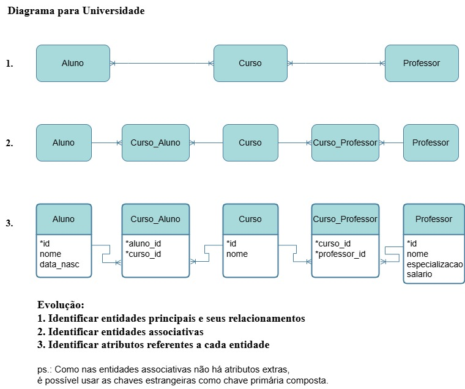

# Cenário: Sistema de Gestão Universitária

Uma universidade precisa armazenar informações sobre seus cursos, professores e alunos. Cada curso é identificado por um código único e tem um nome. Professores são identificados por um ID, têm um nome, especialização e salário. Alunos são identificados por um número de matrícula, têm nome e data de nascimento. Cada curso pode ser lecionado por vários professores, e cada professor pode lecionar vários cursos. Alunos se inscrevem em vários cursos, e cada curso pode ter vários alunos inscritos.

## Diagrama ER

Aqui está o diagrama ER que representa a modelagem desse cenário:

## Comandos SQL

Aqui estão os comandos SQL correspondentes para criar as tabelas e associar os dados. Você pode visualizar os comandos SQL no arquivo [comandos_sql.sql](comandos_sql.sql/Universidade.sql).
