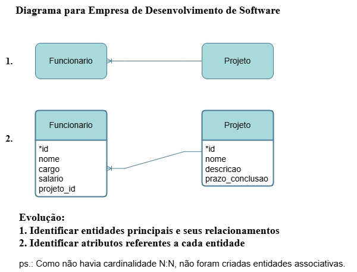

# Cenário: Gestão de Projetos de Software

Uma empresa de desenvolvimento de software precisa gerenciar seus projetos e funcionários. Cada projeto tem um código, nome, descrição e prazo de conclusão. Funcionários são identificados por um ID e têm nome, cargo e salário. Cada projeto pode ter vários funcionários trabalhando nele, mas um funcionário só pode estar em um projeto de cada vez.

## Diagrama ER

Aqui está o diagrama ER que representa a modelagem desse cenário:

## Comandos SQL

Aqui estão os comandos SQL correspondentes para criar as tabelas e associar os dados. Você pode visualizar os comandos SQL no arquivo [comandos_sql.sql](comandos_sql.sql/EmpresaSoftware).
